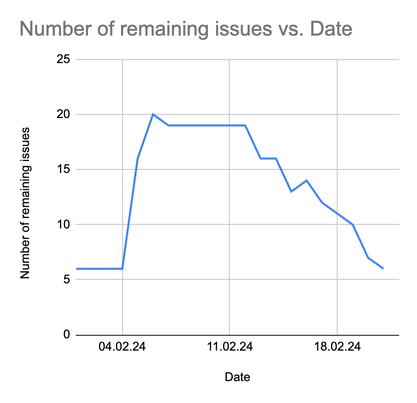
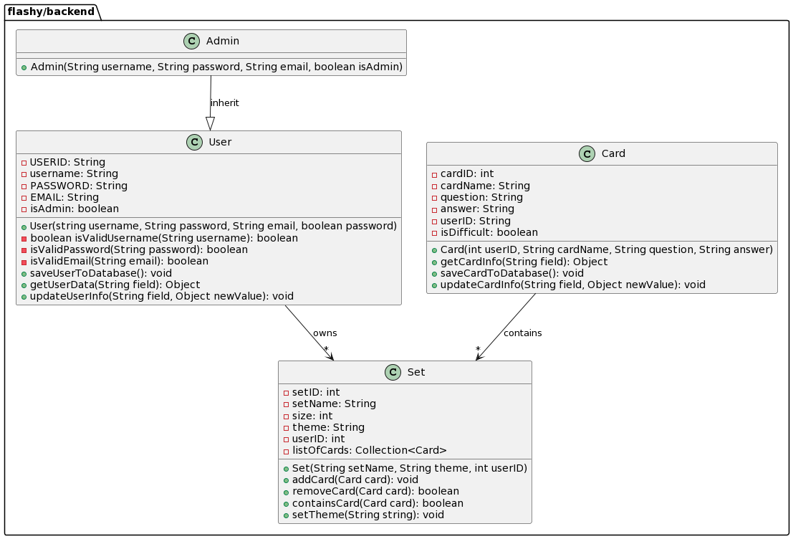
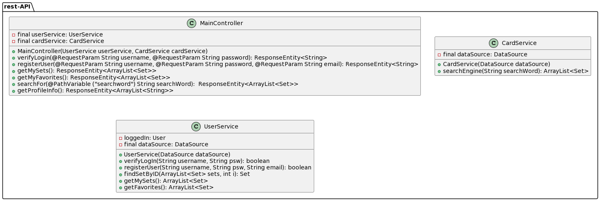
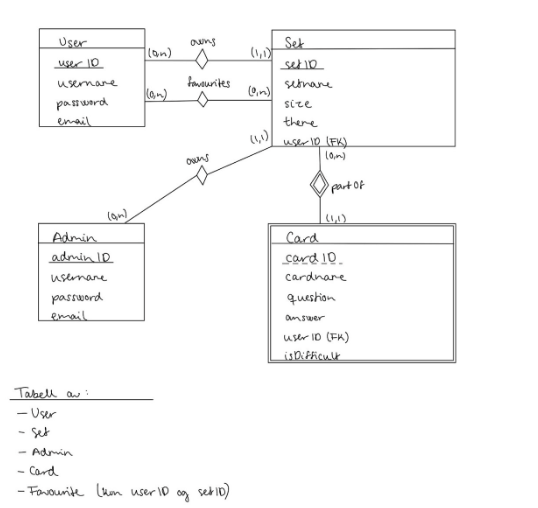
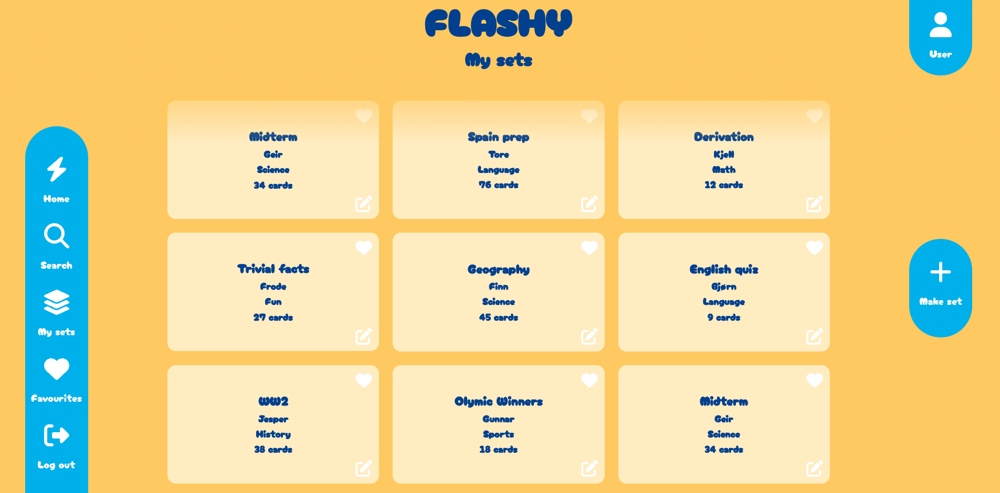

# Flashy

## Overview

Welcome to our project for the "Programvareutvikling" course. Our product owner tasked us with creating a flashcard-based application. After discussions with the product owner, we decided to develop an application that allows users to practice for exams or similar tasks through an engaging and interactive web-based platform. The application is built using a Java-based technology stack, employing React for frontend development, the Spring Boot framework for handling requests, and a MySQL database for information storage.

## Building and running the App

Flashy uses Maven for building and running the backend of the application. To start the application, navigate to flashy/backend using cd backend from the root of the project. Run `mvn spring-boot:run` to start the Spring project and the REST API. To perform unit tests for the backend, run `mvn install`.

The frontend of our project utilizes the Node Package Manager (npm). Start the frontend on localhost by navigating to flashy/frontend and running `npm start` to open the project on a localhost.

For development and testing purposes, we have integrated various development tools. To check code coverage of the backend, navigate to flashy/backend and run `mvn jacoco:report`. Copy the path from index.html found in flashy/backend/target/site.

To maintain code structure, we use tools like Checkstyle and SpotBugs. Run these tools from flashy/backend with `mvn checkstyle:check` and `mvn spotbugs:check`.

## User Stories for Sprint 1

1. Profile Management: As a user, I want to create and manage my profile to view my own sets and favorites.
2. Storage and Organization: As a user, I want to create, edit, and delete my own sets to customize my learning experience.
I also want to decide if my sets should be private or public to control who sees my content
3. Search Functions: As a user, I want to search through sets to quickly find relevant learning resources
4. User types: As an admin, I want to create and manage admin users to ensure app security and organization
5. Moderation and Interaction: As an admin, I want to delete inappropriate sets to maintain content quality.
As a user, I want to "like" and comment on sets to engage with other users and provide feedback.
6. Favorite Lists: As a user, I want to save sets to a favorite list so that I can easily revisit them later
7. Filter Functions: As a user, I want to filter sets to quickly find relevant learning resources.

## Requirements

- **Java 17**: Flashy is built with Java.
- **Spring boot 3.2.2**: The application uses the Spring Noot framework
- **Maven 3.11.0**: The project uses the devolpment tool Maven.
- **React 18.20**: The UI is made with the JS framework React

## Dependencies

- **mockito 3.12.4**: Used for mocking DB in tests
- **mysql 8.0.28**: Used for connecting to the DB
- **jacoco 0.8.7**: Used for displaying test coverage
- **spotbugs 4.8.3**: Used for checking code for bugs
- **checkstyle 3.2.0**: Used for checking code structure
- **fontawsome 6.5.1**: Icons for user interface
- **jest 27.5.1**: testing tool for UI
- **istanbul 3.1.6**: code coverage tool for frontend

## Agile practices

The team has incorporated a diverse range of agile methods in the development of user stories for Sprint 1. The sprint commenced with a meeting with the product owner, during which a product backlog was created containing all the user stories for the project. Subsequently, the group utilized planning poker to establish consensus on the estimated time for each story. Based on this estimation and the preferences of the product owner, we selected stories for Sprint 1.

Throughout the development phase, the team conducted 2-3 meetings per week, and each meeting commenced with a stand-up. Agile practices such as pair programming were explored, and the team monitored progress through the use of a burn-down chart.

## Burn-down chart

## Backend class diagram

## rest-API class diagram

### ER-diagram

## Figma

Link to the projects Figma model: <https://l.messenger.com/l.php?u=https%3A%2F%2Fwww.figma.com%2Ffile%2FLfOcIrsRoWDcqRQ4T0WheO%2FPU%3Ftype%3Ddesign%26node-id%3D100%253A47%26mode%3Ddesign%26t%3DaOj3bOUdxYzxMvq1-1&h=AT2zTyy2Z4VgNi0JAfIihOTq8mh_tQiYaY0VgsqeRvD9ukAzdXTEreAv6_BZO4IhXXIWzLYTTkzG-zGY9L35lx9cy90wOimnCn_cqP3-hZ3S8TGVtms4WTThRrA6N05ZmFlqugi2Gys>

## Visuals

## Progress for spring 1

In Sprint 1, the team spent the first week researching the technology stack, agile development methods, and gaining knowledge in the chosen tech stack. After that, the team created a repository for development with Maven and initialized React and Spring projects. Subsequently, the team started working on user stories for Sprint 1, applying agile practices and tools.

## Future developement

For Sprint 2, our focus will be on completing user stories in progress from Sprint 1, addressing technical debt, and developing user stories for Sprint 2.

## Authors and acknowledgment

Jacob Gullesen Hagen
Sigurd Hagen
Guro Kristensen
Knut Lembach-Beylegaard
Kaja Prestnes Lind
Christina Sophie Devold Sedlmayr
Steinar Stuestøl
